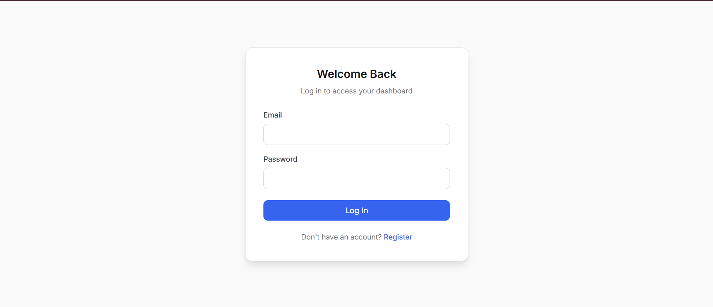
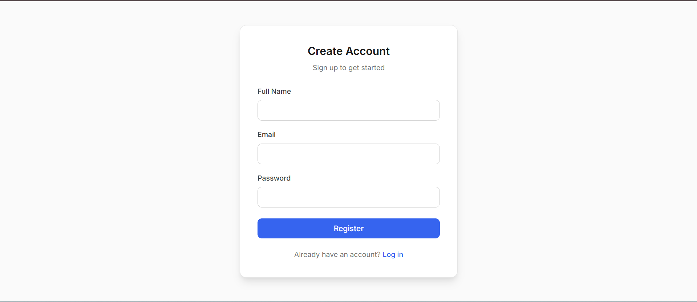
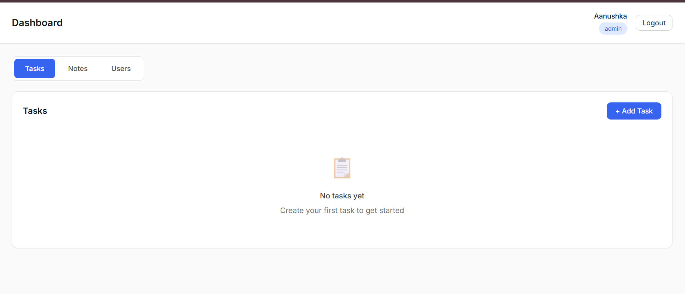
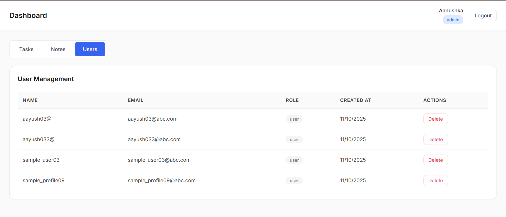

# 🛡️ Role-Based Access Control (RBAC) System

A complete full-stack application built with a **FastAPI backend** and **React frontend**, featuring JWT authentication, role-based access control, and comprehensive user management.

---

## 📸 Application Screenshots

<div align="center">

### 🔐 Authentication Pages
**Login Interface**  
  
User login with email and password fields.

**Registration Interface**  
  
User registration for creating new accounts.

### 🎯 Dashboard & Management
**Main Dashboard**  
  
Dashboard with navigation and user management.

**User Management**  
  
Admin panel showing user list with actions.

</div>

---

## 🚀 Features

### 🧩 Backend
- Secure JWT Authentication & Role-Based Access (User/Admin)
- Password hashing with bcrypt
- Asynchronous MongoDB integration using Motor
- Automatic admin user creation on startup
- RESTful API with Pydantic validation and clear error handling
- Proper CORS configuration for frontend integration

### 💻 Frontend
- Modern, responsive React UI built with shadcn/components
- Role-protected routes and JWT-based authentication
- Real-time dashboard for managing tasks and notes
- Admin panel for user management
- Form validation with smooth UX and error feedback

---

## 🗂️ Project Structure

```plaintext
.
├── .gitignore
├── backend
│   ├── .env
│   ├── requirements.txt
│   ├── server.py
│   ├── __init__.py
│   ├── __pycache__
│   │   └── server.cpython-313.pyc
├── frontend
│   ├── .env
│   ├── .gitignore
│   ├── components.json
│   ├── craco.config.js
│   ├── package-lock.json
│   ├── package.json
│   ├── postcss.config.js
│   ├── public
│   │   ├── favicon.ico
│   │   ├── images
│   │   │   ├── dashboard-screenshot.png
│   │   │   ├── login-screenshot.png
│   │   │   ├── register-screenshot.png
│   │   │   ├── users-screenshot.png
│   │   ├── index.html
│   ├── src
│   │   ├── App.css
│   │   ├── App.js
│   │   ├── App.test.js
│   │   ├── components
│   │   │   ├── Dashboard.js
│   │   │   ├── Login.js
│   │   │   ├── Notes.js
│   │   │   ├── Register.js
│   │   │   ├── Tasks.js
│   │   │   ├── ui
│   │   │   │   ├── *.jsx (UI components)
│   │   │   ├── Users.js
│   │   ├── hooks
│   │   │   └── use-toast.js
│   │   ├── index.css
│   │   ├── index.js
│   │   ├── lib
│   │   │   └── utlis.js
│   │   ├── logo.svg
│   │   ├── reportWebVitals.js
│   │   ├── setupTests.js
│   │   ├── utils.js
├── postman_collection.json
├── project_structure.txt
├── README.md
````

---

## ⚙️ Quick Start

### Prerequisites

* Python 3.8+
* Node.js 16+
* MongoDB (Compass optional)
* Git

---

### 🧠 Step 1: Backend Setup

```bash
cd backend
pip install -r requirements.txt
```

Create a `.env` file:

```env
MONGO_URL=mongodb://localhost:27017
DB_NAME=Assignment
JWT_SECRET_KEY=your-super-secret-jwt-key-here
JWT_ALGORITHM=HS256
JWT_EXPIRATION_MINUTES=1440
CORS_ORIGINS=http://localhost:3000
```

Run the backend:

```bash
python server.py
```

Backend runs at: [http://127.0.0.1:8000](http://127.0.0.1:8000)

---

### 🪄 Step 2: Frontend Setup

```bash
cd frontend
npm install
echo "REACT_APP_BACKEND_URL=http://127.0.0.1:8000/api/v1" > .env
npm start
```

Frontend runs at: [http://localhost:3000](http://localhost:3000)

---

## 🧪 Testing Accounts

### Admin Accounts

| Email                | Password    | Role  |
| -------------------- | ----------- | ----- |
| `aanushka@admin.com` | `Admin@123` | admin |
| `admin1@admin.com`   | `Admin@123` | admin |
| `admin2@admin.com`   | `Admin@123` | admin |

### Regular User

* Register via the signup page
* Or use: `testuser@example.com` / `User@123`

---

## 🗄️ MongoDB Compass Setup

### Connection Details

* **Connection String:** `mongodb://localhost:27017`
* **Database:** `Assignment`
* **Collections:** `users`, `admins`, `tasks`, `notes`

### Steps

1. Open MongoDB Compass
2. Click **New Connection**
3. Paste the connection string
4. Click **Connect**
5. Select database **Assignment**

---

## 📚 API Endpoints

### Authentication

| Method | Endpoint                | Description       | Access        |
| ------ | ----------------------- | ----------------- | ------------- |
| POST   | `/api/v1/auth/register` | Register new user | Public        |
| POST   | `/api/v1/auth/login`    | Login user        | Public        |
| GET    | `/api/v1/auth/me`       | Get current user  | Authenticated |

### Tasks

| Method | Endpoint             | Description     | Access        |
| ------ | -------------------- | --------------- | ------------- |
| GET    | `/api/v1/tasks`      | Get all tasks   | Authenticated |
| POST   | `/api/v1/tasks`      | Create new task | Authenticated |
| PUT    | `/api/v1/tasks/{id}` | Update task     | Owner only    |
| DELETE | `/api/v1/tasks/{id}` | Delete task     | Owner only    |

### Notes

| Method | Endpoint             | Description     | Access        |
| ------ | -------------------- | --------------- | ------------- |
| GET    | `/api/v1/notes`      | Get all notes   | Authenticated |
| POST   | `/api/v1/notes`      | Create new note | Authenticated |
| PUT    | `/api/v1/notes/{id}` | Update note     | Owner only    |
| DELETE | `/api/v1/notes/{id}` | Delete note     | Owner only    |

### User Management (Admin)

| Method | Endpoint             | Description   | Access     |
| ------ | -------------------- | ------------- | ---------- |
| GET    | `/api/v1/users`      | Get all users | Admin only |
| DELETE | `/api/v1/users/{id}` | Delete user   | Admin only |

---

## 🛠️ Troubleshooting

**Common Issues**

* Ensure MongoDB service is running
* Verify backend `.env` connection string
* Check CORS origins include `http://localhost:3000`
* Confirm `REACT_APP_BACKEND_URL` in frontend `.env`

---

## 🚀 Production Deployment

### Backend

```bash
pip install -r requirements.txt
python server.py
```

### Environment Example

```env
MONGO_URL=your_production_mongodb_url
JWT_SECRET_KEY=your_strong_production_secret
CORS_ORIGINS=your_frontend_domain
```

---

## 🔄 Development Workflow

1. Start MongoDB
2. Run Backend → `cd backend && python server.py`
3. Access: [http://127.0.0.1:8000](http://127.0.0.1:8000)
4. Run Frontend → `cd frontend && npm start`
5. Access: [http://localhost:3000](http://localhost:3000)
6. Test with admin or new user accounts

---

**✅ Ready to use! Access your application at [http://localhost:3000](http://localhost:3000)**

```
